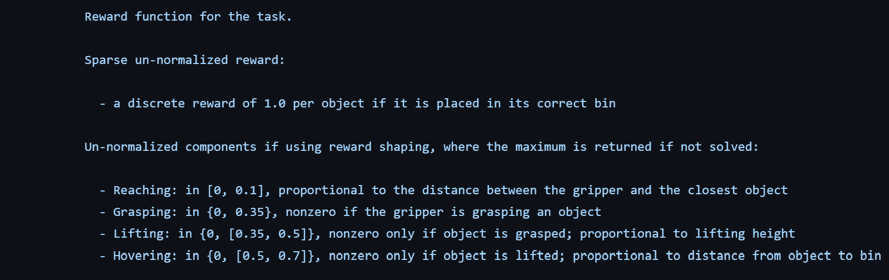
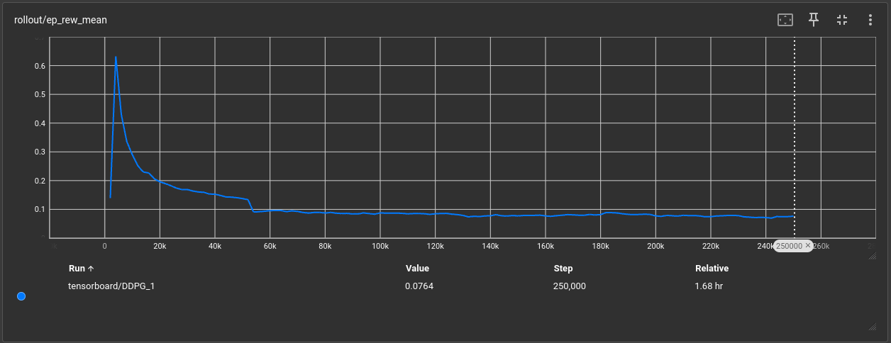
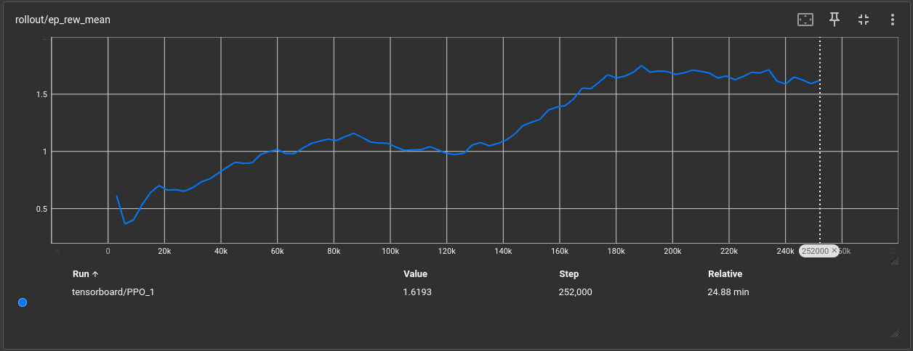
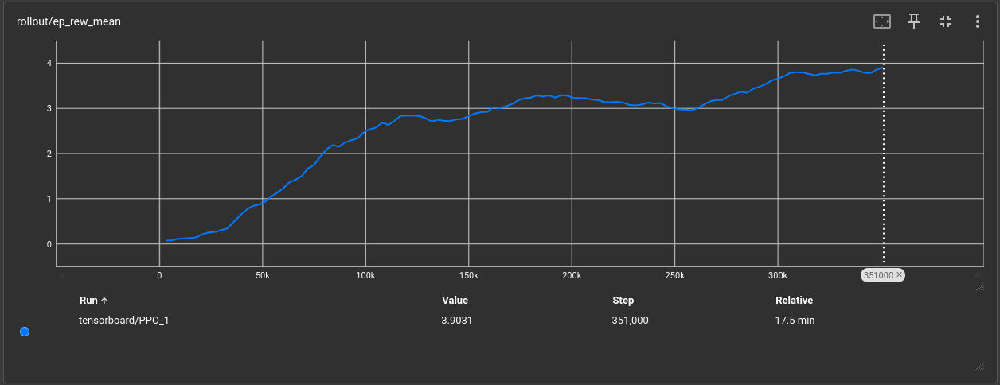
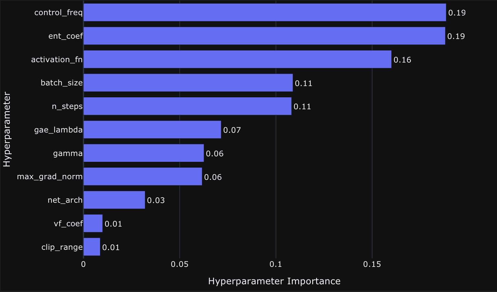
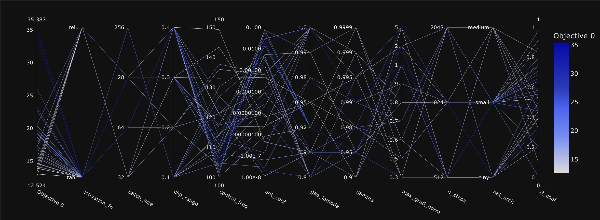

# Solving the Pick-and-Place Environment in Robosuite


Welcome to the "Project Assignment: Solving the Pick-and-Place Environment in Robosuite" repository! This repository is intended to allow for the replication of our project results and documents its progress including insights as well as tests.

## Table of Contents
 This repository holds the source code framework for training and evaluating the policy in the pick-and-place environments as well as a configuration file to set the different robosuite modules (robots, controllers, etc.) and tune hyperparameters
- [Project Description](#project-description)
	 - [Course Description](#course-description)
	 - [Task Description](#task-description)
- [Installation and Setup](#installation-and-setup)
- [Getting Started](#getting-started)
  	- [Jupyter Notebook Documentation](#jupyter-notebook-documentation)
	- [Initial parameters](#initial-parameters)
	- [Train an Agent](#train-an-agent)
	- [Employ an Agent](#employ-an-agent)
	- [Insights and further testing](#insights-and-further-testing)
- [Hyperparameter Tuning with Optuna](#hyperparameter-tuning-with-optuna)
	- [Installing Optuna](#installing-optuna)
	- [Running Optuna](#running-optuna)
	- [Optuna Dashboard](#optuna-dashboard)
	- [Analysis](#analysis)
	- [Testing the optimal parameters](#testing-the-optimal-parameters)
- [Conclusion](#conclusion)
	- 	[Future Work](#future-work)
- [Sources](#sources)
	- [Benchmarks and Implementations](#benchmarks-and-implementations)
	- [Papers](#papers)
- [Contributors](#contributors)

## Project Description
### Course description
**[Innovative Konzepte zur Programmierung von Industrierobotern](https://ipr.iar.kit.edu/lehrangebote_3804.php)** is an interactive course at the Karlsruhe Institute of Technology, supervised by Prof. Björn Hein, dealing with new methods of programming industrial robots. The topics covered in this lecture include collision-detection, collision-free path planning, path optimization and the emerging field of Reinforcement Learning. As the conclusion of the lecture, a final project related to one of these topics must be implemented by a team of two course participants.
### Task Description
Our team's task is to solve the **[Pick-and-Place Environment](https://robosuite.ai/docs/modules/environments.html#pick-and-place)** from Robosuite using Reinforcement Learning. In this simulated environment, a robot arm needs to place four objects from a bin into their designated container. At every initialization of the environment, the location of the objects are randomized and the task is considered successful is the robot arm manages to place every object into their corresponding container. 

#### Subtasks:
The task (for each object) can be subdivided into the following subtasks:

 1. Reaching: Move to nearest object
 2. Grasping: Pick up the object
 3. Lifting: Carry object to container
 4. Hovering: Drop object into corresponding container
 5. Repeat starting at 1. until all objects are placed in their corresponding containers

#### Reward function:
The reward function is essential to understanding the behaviour of the robot while interacting with the environment. In robosuite each environment has implemented two different kinds of reward functions. A binary reward rewards the robot only in the case if the object is placed in its corresponding container. We employed the dense reward function which uses reward shaping and rewards the robot for each subtask (like reaching & grasping), these rewards are then added successively. The image below taken from the [python code for the pick-and-place task](https://github.com/ARISE-Initiative/robosuite/blob/eafb81f54ffc104f905ee48a16bb15f059176ad3/robosuite/environments/manipulation/pick_place.py#L260) describes the additional rewards for each subtask:



## Installation and Setup
Employing robosuite on windows is possible (e.g. by using a VM or WSL), but it leads to complications during installation, which is why using a linux or mac computer is highly recommended. Our repository also uses the RL algorithm implementations from the stable release of the stable baselines 3 repository.

Install all dependencies (robosuite, SB3,..) needed for this repository by running the following command.
More information about their installation can be found in the [robosuite installation guide](https://robosuite.ai/docs/installation.html) and the [SB3 installation guide](https://stable-baselines3.readthedocs.io/en/master/guide/install.html).

On debian the non free cuda driver has to be installed as a kernel-level module in order to use the GPU for calculations. This change resulted in crashes of wayland DSP so a X11 has to be used as a fallback.

Our code is written for Python3.11. The following python packages are needed: numpy (below version 2), robosuite, stable-baselines3[extra], libhdf5, h5py.
All requirements can be installed with the following command.

```
!python3  -m  pip  install  ipywidgets
!TMPDIR='/var/tmp'  python3  -m  pip  install  -r  requirements.txt
```
This notebook can be used to experiment with different parameters. Once the following "imports" code block was executed, parameters can be reconfigured and used to train or employ agents. For this purpose each functionality is embedded into its own code block. The intended way is to configure the parameters and execute the corresponding code block. After that an agent can be trained with those parameters. After training, the logs can be analyzed with tensorboard or an agent can be simulated. Before the next test, adjust the parameters again using the parameter code block. To view a previously trained model, set the parameters to the specified values and execute the "employ an agent" code block. Remember, the parameters are only updated after executing the code block.

```
import numpy as np
import os
from sys import platform
import torch
from torch import nn as nn
import robosuite as suite


from robosuite import load_controller_config
from robosuite.environments.base import register_env
from robosuite.controllers import load_controller_config
from stable_baselines3.common.noise import NormalActionNoise
from stable_baselines3.common.save_util import save_to_zip_file, load_from_zip_file
from stable_baselines3.common.monitor import Monitor
from stable_baselines3.common.vec_env import DummyVecEnv, VecNormalize, SubprocVecEnv
from stable_baselines3.common.env_util import make_vec_env
from stable_baselines3.common.utils import set_random_seed
from stable_baselines3.common.callbacks import EvalCallback, CheckpointCallback
from robosuite.wrappers import GymWrapper

from stable_baselines3 import PPO, DDPG, SAC


# Check if cuda(linux) or mps(mac) is available
if torch.cuda.is_available():
	device = torch.device("cuda")
	print("Cuda backend is available.")
elif torch.backends.mps.is_available():
    device = torch.device("mps")
    print("Mps backend is available.")
else:
	device = torch.device("cpu")
	print("Cuda backend is not available, using CPU.")
```

## Getting started
### Jupyter Notebook Documentation
The project documentation, code, insights as well as our results are documented in the file main.ipynb which this readme is referring to.

### Initial parameters
To get a feel of how different parameters of the model affect the model performance in a specific environment, we train the model subsequently with different parameters. The following script generates a configuration object defining all parameters that can be adjusted for these subsequent runs.
```
parameters = dict(
    # Environment
    robot="Sawyer",            # Panda, IIWA, Sawyer
    gripper="default",
    controller="OSC_POSE",     # OSC_POSE, OSC_POSITION, JOINT_POSITION, JOINT_VELOCITY
    seed=2346421,             
    control_freq=100,
    horizon=512,
    camera_size=128,
    episodes=1000,
    eval_episodes=1,
    n_processes=8,
    n_eval_processes=1,
    # Algorithm 
    algorithm="PPO",            # PPO, DDPG, SAC
    policy="MlpPolicy",
    gamma=0.99,
    learning_rate=1e-3,
    n_steps=512,
    batch_size=128,                 # Only DDPG and SAC
    entropy_coef=0,
    clip_range=0.2,
    gae_lambda=0.95,
    max_grad_norm=0.5,
    vf_coef=0.5,
    net_arch_type="medium",
    activation_fn_name="tanh",
    single_object=True,             
)
# Select process start method depending on the os
if platform == "linux" or platform == "linux2":
    print('Recognized Linux. Setting start method to forkserver')
    parameters["start_method"] = 'forkserver'
elif platform == 'darwin':
    print('Recognized macOS. Setting start method to spawn')
    parameters["start_method"] = 'spawn'
elif platform == 'win32':
    print('Windows? Mutig.')
    parameters["start_method"] = 'spawn'
else:
    print('Could not determine OS platform. Set start method to forkserver')
    parameters["start_method"] = 'forkserver'

# Generate directory name
test_name = str(parameters["robot"]) + "_freq" + str(parameters["control_freq"]) + "_hor" + str(parameters["horizon"]) + "_learn" + str(parameters["learning_rate"]) + "_episodes" + str(parameters["episodes"]) + "_control" + str(parameters["controller"])

if (parameters["single_object"]):
    parameters["single_object"] = 2
    test_name = test_name + "_singleobject"
else:
    parameters["single_object"] = 0
```
Initial parameters seen in this dict (like the panda robot and the OSC_POSE controller) are taken from multiple sources (Benchmarks, Implementations & Papers) referred to under [Sources](#Sources). By initial exploring, we discovered that changing the robot model, batch_size, as well as the learning rate have the greatest impact on the model performance.

### Train an Agent
Run the script in the notebook to train a model with the previously specified parameters. The model and tensorboard logs will be stored in the "tests" folder named according to the specified parameters.

```
#Set up TensorBoard logger
tensor_logger = "./" + test_name + "/tensorboard"
print("TensorBoard logging to", tensor_logger)

# Set controller configuration
controller_config = load_controller_config(default_controller=parameters["controller"])

# Define the environment setup
# Make robosuite environment into a gym environment as stable baselines only supports gym environments
def make_env(env_id, options, rank, seed=0):
    def _init():
        env = GymWrapper(suite.make(env_id, **options))
        env.render_mode = 'mujoco'
        env = Monitor(env)
        env.reset(seed=seed + rank)
        return env
    set_random_seed(seed)
    return _init

# Setup environment
# Define environment parameters for specific environment "PickPlace"
env = SubprocVecEnv([make_env(
    "PickPlace",
    dict(
        robots=[parameters["robot"]],                      
        gripper_types=parameters["gripper"],                
        controller_configs=controller_config,   
        has_renderer=False,                     
        has_offscreen_renderer=True,
        control_freq=parameters["control_freq"],
        horizon=parameters["horizon"],
        single_object_mode=parameters["single_object"],
        object_type="milk",
        use_object_obs=False,                       # don't provide object observations to agent
        use_camera_obs=True,                        # provide image observations to agent
        camera_names="agentview",                   # use "agentview" camera for observations
        camera_heights=parameters["camera_size"],   # image height
        camera_widths=parameters["camera_size"],    # image width
        reward_shaping=True),                       # use a dense reward signal for learning
        i,
        parameters["seed"]
        ) for i in range(parameters["n_processes"])], start_method=parameters["start_method"])
        
env = VecNormalize(env)

net_arch = {
        "tiny": dict(pi=[64], vf=[64]),
        "small": dict(pi=[64, 64], vf=[64, 64]),
        "medium": dict(pi=[256, 256], vf=[256, 256]),
    }[parameters["net_arch_type"]]

activation_fn = {"tanh": nn.Tanh, "relu": nn.ReLU, "elu": nn.ELU, "leaky_relu": nn.LeakyReLU}[parameters["activation_fn_name"]]

# Initialize model for training:
if parameters["algorithm"] == "PPO":
    model = PPO("MlpPolicy", 
                env, 
                verbose=1, 
                batch_size=parameters["batch_size"], 
                gamma=parameters["gamma"], 
                ent_coef=parameters["entropy_coef"],
                clip_range=parameters["clip_range"],
                gae_lambda=parameters["gae_lambda"],
                max_grad_norm=parameters["max_grad_norm"],
                vf_coef=parameters["vf_coef"],
                policy_kwargs=dict(
                                net_arch=net_arch,
                                activation_fn=activation_fn,
                                ortho_init=False,
                                ),
                learning_rate=parameters["learning_rate"], 
                n_steps=parameters["n_steps"], 
                tensorboard_log=tensor_logger, 
                device=device)
elif parameters["algorithm"] == "DDPG":
    n_actions = env.action_space.shape[-1]
    action_noise = NormalActionNoise(mean=np.zeros(n_actions), sigma=0.1 * np.ones(n_actions))
    model = DDPG(parameters["policy"], env, action_noise=action_noise, verbose=1, batch_size=parameters["batch_size"], tensorboard_log=tensor_logger, device=device)
elif parameters["algorithm"] == "SAC":
    model = SAC(parameters["policy"], env, verbose=1, batch_size=10, train_freq=(1, "episode"), learning_rate=0.001, gradient_steps=1000, learning_starts=3300, tensorboard_log=tensor_logger, device=device)	
else:
    raise ValueError("Invalid algorithm specified in the configuration.")
    
'''
# Load existing model to continue training
# Comment out the above model initialization and uncomment the following code to load an existing model
env.load("./" + test_name + '/env.pkl', env)
if parameters["algorithm"] == "PPO":
    model = PPO.load("./" + test_name + "/model.zip", env=env, tensorboard_log=tensor_logger, device=device)
elif config["algorithm"] == "DDPG":
    model = DDPG.load("./" + test_name + "/model.zip", env=env,tensorboard_log=tensor_logger, device=device)
elif config["algorithm"] == "SAC":
    model = SAC.load("./" + test_name + "/model.zip", env=env, tensorboard_log=tensor_logger, device=device)
else:
    raise ValueError("Invalid algorithm specified in the configuration.")
'''

# Train the model and save it
model.learn(total_timesteps=parameters["horizon"]*parameters["episodes"], progress_bar=True)
model.save("./" + test_name + "/model.zip")
env.save('./' + test_name + '/env.pkl')

env.close()
```

#### Tensorboard
The following command will open a locally hosted http server for the tensorboard. Navigate to [http://localhost:6006](http://localhost:6006/) to view the data logged during training.
```
!python  -m  tensorboard.main  --logdir=tensor_logger
```

### Employ an Agent
Running the cell corresponding to the employment of the trained model, the trained model defined by the specified parameters will be used for the task execution. If the trained agent exists, you can run it in the specified environment.

```
if not os.path.isdir('./' + test_name):
    print("No model found for this configuration. Train a model first!")
else:
    print('Using model ' + test_name)

    # Set controller configuration
    controller_config = load_controller_config(default_controller=parameters["controller"])

    # Define the environment setup
    # Make robosuite environment into a gym environment as stable baselines only supports gym environments
    def make_env(env_id, options, rank, seed=0):
        def _init():
            env = GymWrapper(suite.make(env_id, **options))
            env.render_mode = 'mujoco'
            env = Monitor(env)
            env.reset(seed=seed + rank)
            return env
        set_random_seed(seed)
        return _init

    # Setup environment
    # Define environment parameters for specific environment "PickPlace"
    env = SubprocVecEnv([make_env(
        "PickPlace",
        dict(
            robots=[parameters["robot"]],                      
            gripper_types=parameters["gripper"],                
            controller_configs=controller_config,   
            has_renderer=True,
            has_offscreen_renderer=True,
            control_freq=parameters["control_freq"],
            horizon=parameters["horizon"],
            single_object_mode=parameters["single_object"],
            object_type="milk",
            use_object_obs=False,                       # don't provide object observations to agent
            use_camera_obs=True,                        # provide image observations to agent
            camera_names="agentview",                   # use "agentview" camera for observations
            camera_heights=parameters["camera_size"],   # image height
            camera_widths=parameters["camera_size"],    # image width
            reward_shaping=True),                       # use a dense reward signal for learning
            i,
            parameters["seed"]
            ) for i in range(parameters["n_eval_processes"])], start_method=parameters["start_method"])
    
    env = VecNormalize.load("./" + test_name + '/env.pkl', env)

    if parameters["algorithm"] == "PPO":
        model = PPO.load("./" + test_name + "/model.zip", env=env, device=device)
    elif parameters["algorithm"] == "DDPG":
        model = DDPG.load("./" + test_name + "/model.zip", env=env, device=device)
    elif parameters["algorithm"] == "SAC":
        model = SAC.load("./" + test_name + "/model.zip", env=env, device=device)
    else:
        raise ValueError("Invalid algorithm specified in the configuration.")

    # reset the environment to prepare for a rollout
    env.training = False
    env.norm_reward = False
    episode_rewards = []
    eval_episodes = parameters["eval_episodes"]
    for i_episode in range(3):
        obs = env.reset()
        total_reward = 0
        for t in range(parameters["horizon"]):
            action, _states = model.predict(obs)            # use observation to decide on an action
            obs, reward, done, info = env.step(action) # play action
            total_reward += reward
            env.render()
            if done.all():
                print("Episode finished after {} timesteps".format(t+1))
                break
        episode_rewards.append(total_reward)
    average_reward_per_environment = sum(episode_rewards) / len(episode_rewards)
    average_reward = np.mean(average_reward_per_environment)
    print(f"Iteration {i_episode+1}/{eval_episodes}, Average Reward per Environment: {average_reward_per_environment}, Average Reward: {average_reward}")
    
    # Close environment
    env.close()
```

### Insights and further testing

With this setup, we tested a variety of robot configurations and parameters, evaluating them based on visual critic and the total collected reward per episode.

After some research we found that [publications](#sources) predominantly use off-policy algorithms for robotic tasks, whereby we already knew the DDPG algorithm from the lecture. This selection of recommended algorithms already reduced the initially overwhelming number of possible configurations and parameters to choose from.

#### Off-Policy Algorithms
While trying to setup the environment, we noticed a major downside of DDPG: To benefit of past experiences, the algorithm is using a large replay buffer, but even with just a small replay buffer of 100 episodes, the execution failes while trying to reserve 79 Gb of memory. 
Another often used algorithm in publications is the SAC (Soft Actor-Critic) algorithn. However, since SAC is an off-policy algorithm as well, it suffers from the same problem. 
We managed to reduce the memory usage to 8 Gb by reducing the image resolution of the observation camera drastically (from 128x128 to 32x32 pixels).

The demo found in ./assets/video/DDPG.mp4 was produced using the DDPG Algorithm with the following parameters: control_freq=50, horizon=1000, learning_rate=0.001, episodes=100, camera_size=30, control_mode=OSC_POSE, n_processes=1 and a replay buffer of 100 episodes. It is stored in the "demo_models" folder appropriately named "DDPG".

Reviewing these results, we can assume that the camera resolution is just too low to provide actual meaningful input data. The robot arm swings around without even trying to approach any of the objects. 



This graph shows the episode reward during training and portrays how even with having higher rewards at the beginning, training was not effective the more steps/episodes are being trained.
Despite the frequent use of off-policy methods, we came to the conclusion that due to them being memory-inefficient and the resulting subpar performance, off-policy methods are not feasible with our hardware.

#### PPO
An on-policy method that was introduced in the lecture is PPO, Proximal Policy Optimization. Similarly to DDPGs we gathered initial parameters from different [sources](#sources), such as [blog posts](#https://medium.com/aureliantactics/ppo-hyperparameters-and-ranges-6fc2d29bccbe).
The first model we trained with the PPO method was configured with the following parameters:
control_freq=20, horizon=2048, gamma=0.99, learning_rate=0.0004, episodes=1000, camera_size=84, control_mode=OSC_POSE, n_processes=6 (16 on Mac). 

Since the training took over 2 hours, adjusting parameters and running the training script would have taken a long time. Therefore, our first step to optimize the parameters was to first reduce the runtime of the tests by reducing the horizon to only focus on the reaching and grasping subtask, the amount of episodes as well as increasing the learning rate.
The following model was trained with control_freq=20, horizon=512, learning_rate=0.001, episodes=500. 
This model is stored in the "demo_models" folder named "Panda_freq20_hor500_learn0.001_episodes500_controlOSC_POSE"

<video width="640" height="360" controls>
  <source src="./.assets/video/panda.mp4" type="video/mp4">
</video>

The simulation under ./assets/video/panda.mp4 shows that the agent is able to approach the objects through its cameras observations. Despite this, the objects get thrown around and glitch through corners due to the high velocities and the large head of the panda robot. Observed can be as well that the gripper is not precise enough to get into a position where it could grasp an object.



The episode reward clearly shows improvement compared to DDPG over training episodes. The graph indicates that more episodes might increase the performance of the model.

To increase the precision, so that the robot rarely knocks over objects, we increased the control frequency for the following test runs and switched to a different robot. So, we ran some tests on the LBR IIWA 7 robot with these changes, which has a smaller dimension and a larger gripper jaws. While it is less likely to knock over the objects, the gripper has difficulties to grasp because of its long jaws. It also tends to exert large velocities, despite high control frequencies and glitch through objects or gets stuck in walls.

The Sawyer robot on the other hand combines a smaller head with shorter gripper jaws. The demo at ./assets/video/ sawyer1.mp4 with the Sawyer robot was trained with the following parameters:
control_freq=100, horizon=500, learning_rate=0.001, episodes=700.
The model is stored in the "demo_models" folder named "Sawyer_freq100_hor500_learn0.001_episodes700_controlOSC_POSE".

<video width="640" height="360" controls>
  <source src="./.assets/video/sawyer1.mp4" type="video/mp4">
</video>

Despite the robot showing promising approaches grasping the objects, it seems like it can't decide which object to focus on.



As it seemed that the model is not yet capable of solving the multi-object task, we decided to simplify it. To ease the decision process for the robot, enable faster training and parameter optimization, we used the single object mode for the pick and place task, where the robot only needs to grasp a single object. In the multi object mode, the robot preferred approaching the milk. As a result, all subsequent tests were focused solely on this object. The next models are trained with 1000 episodes as seen in the graph, the episode reward still seemed to increase with more training episodes.

From the conducted tests, we identified the Sawyer robot with its default gripper and the PPO algorithm as our most promising candidate. An additional insight is that changing the parameters responsible for steps taken until a policy update, the horizon and the control frequency of the robot influences the performance of the agent significantly.

Further tests were conducted, but the lack of computing performance and the parameters being highly correlated with each other served as a strong bottleneck in solving this high-level task. It is easy to overlook configurations which would enable better performance when the parameters correlate with each other. In most cases, changing a parameter requires adapting the other parameters, otherwise the agent might even perform worse. The success of trying random combinations of parameters manually is very limited, since there is a very high number of possible parameter configurations.

## Hyperparameter Tuning with Optuna
### Installing Optuna
To bridge the gap of achieving a higher performance of the agent despite correlating parameters, a wider field of parameters needs to be evaluated.

The [Optuna hyperparameter optimization](https://optuna.org) framework makes this task feasible by automating the hyperparameter search. By sampling for each run, called trial, a value for each parameter from a specified range and training a model with these parameters, the model performance can be evaluated based on the mean reward. Optuna then provides after a specified number of trials which hyperparameters lead to the best performance, have the highest influence on model performance and how they correlate to each other.

### Running Optuna
Running the optuna cell executes 100 optuna trials. Parameter ranges for the PPO algorithm are taken from the [RL3 baselines zoo repository](https://github.com/DLR-RM/rl-baselines3-zoo/blob/726e2f1d3f1a6ea58ad4ae61c02a4ba71d241e4b/rl_zoo3/hyperparams_opt.py#L11C5-L11C22). To reduce the hyperparameter search space, i.e. limit the number of trials, we either kept certain parameters fixed or reduced their range based on gathered insights from previous tests.

```
import yaml
from torch import nn as nn
import optuna
from optuna.visualization import plot_optimization_history


# Set name of study
study_name = "study_sawyer_pickplace"
storage_name = "sqlite:///{}.db".format(study_name)

# Load configuration
with open("config_hyperparams.yaml") as stream:
    config = yaml.safe_load(stream)

# Method to evaluate the policy
def evaluate_policy(model, env, n_eval_episodes=5):
    all_episode_rewards = []
    for _ in range(n_eval_episodes):
        episode_rewards = []
        done = np.array([False])
        obs = env.reset()
        while not done.all():
            action, _ = model.predict(obs, deterministic=True)
            obs, reward, done, info = env.step(action)
            episode_rewards.append(reward)
        all_episode_rewards.append(np.sum(episode_rewards))
    mean_reward = np.mean(all_episode_rewards)
    return mean_reward

def objective(trial):
    # Suggest hyperparameters
    #learning_rate = trial.suggest_float('learning_rate', 1e-4, 1e-2, log=True)
    learning_rate = 0.001
    batch_size = trial.suggest_categorical('batch_size', [32, 64, 128, 256])
    gamma = trial.suggest_categorical('gamma', [0.9, 0.95, 0.98, 0.99, 0.995, 0.999, 0.9999])
    n_steps = trial.suggest_categorical('n_steps', [512, 1024, 2048])
    #horizon = trial.suggest_categorical('horizon', [512, 1024, 2048])
    horizon = 512
    control_freq = trial.suggest_uniform('control_freq', 100, 150)
    #total_timesteps = trial.suggest_categorical('total_timesteps', [1e5, 2e5, 5e5, 1e6, 2e6])
    total_timesteps = 3e5
    ent_coef = trial.suggest_float("ent_coef", 0.00000001, 0.1, log=True)
    clip_range = trial.suggest_categorical("clip_range", [0.1, 0.2, 0.3, 0.4])
    #n_epochs = trial.suggest_categorical("n_epochs", [1, 5, 10, 20])
    gae_lambda = trial.suggest_categorical("gae_lambda", [0.8, 0.9, 0.92, 0.95, 0.98, 0.99, 1.0])
    max_grad_norm = trial.suggest_categorical("max_grad_norm", [0.3, 0.5, 0.6, 0.7, 0.8, 0.9, 1, 2, 5])
    vf_coef = trial.suggest_float("vf_coef", 0, 1)
    net_arch_type = trial.suggest_categorical("net_arch", ["tiny", "small", "medium"])

    print(
        f"Learning rate: {learning_rate}, "
        f"Batch size: {batch_size}, "
        f"Gamma: {gamma}, "
        f"N steps: {n_steps}, "
        f"Horizon: {horizon}, "
        f"Control freq: {control_freq}, "
        f"Total timesteps: {total_timesteps}, "
        f"Entropy coefficient: {ent_coef}, "
        f"Clip range: {clip_range}, "
        f"GAE lambda: {gae_lambda}, "
        f"Max grad norm: {max_grad_norm}, "
        f"Value function coefficient: {vf_coef}, "
        f"Network architecture: {net_arch_type}")

    # Set controller configuration
    controller_config = load_controller_config(default_controller=config["controller"])

    # Setup environment
    # Define environment parameters for specific environment "PickPlace"
    env_options = {
        "robots": config["robot_name"],
        "controller_configs": controller_config,
        "gripper_types": config["gripper"],
        "has_renderer": False,
        "has_offscreen_renderer": True,
        "single_object_mode": 2,
        "object_type": "milk",
        "use_camera_obs": True,         # provide image observations to agent
        "use_object_obs": False,        # don't provide object observations to agent
        "camera_names": "agentview",    # use "agentview" camera for observations
        "camera_heights": 128,          # image height
        "camera_widths": 128,           # image width
        "reward_shaping": True,         # use a dense reward signal for learning
        "horizon": horizon,
        "control_freq": control_freq,
    }    
    
    # Setup environment
    env = SubprocVecEnv([make_env("PickPlace", env_options, i, config["seed"]) for i in range(config["num_envs"])], start_method=parameters["start_method"]) #remove start_method='spawn' if you are not training on MPS
    env = VecNormalize(env)

    # TODO: account when using multiple envs
    if batch_size > n_steps:
        batch_size = n_steps

    # Check if cuda(linux) or mps(mac) is available
    if torch.cuda.is_available():
        device = torch.device("cuda")
        print("Cuda backend is available.")
    elif torch.backends.mps.is_available():
        device = torch.device("mps")
        print("Mps backend is available.")
    else:
        device = torch.device("cpu")
        print("Cuda backend is not available, using CPU.")

    # Orthogonal initialization
    ortho_init = False

    activation_fn_name = trial.suggest_categorical("activation_fn", ["tanh", "relu"])

    # Independent networks usually work best when not working with images
    net_arch = {
        "tiny": dict(pi=[64], vf=[64]),
        "small": dict(pi=[64, 64], vf=[64, 64]),
        "medium": dict(pi=[256, 256], vf=[256, 256]),
    }[net_arch_type]

    activation_fn = {"tanh": nn.Tanh, "relu": nn.ReLU, "elu": nn.ELU, "leaky_relu": nn.LeakyReLU}[activation_fn_name]

    # Initialize model
    if config["algorithm"] == "PPO":
        model = PPO(config["policy"],
                    env,
                    learning_rate=learning_rate,
                    batch_size=batch_size,
                    gamma=gamma,
                    n_steps=n_steps,
                    ent_coef=ent_coef,
                    clip_range=clip_range,
                    gae_lambda=gae_lambda,
                    max_grad_norm=max_grad_norm,
                    vf_coef=vf_coef,
                    policy_kwargs=dict(
                                    net_arch=net_arch,
                                    activation_fn=activation_fn,
                                    ortho_init=ortho_init,
                                    ),
                    verbose=0,
                    tensorboard_log=None,
                    device=device
                    )
    elif config["algorithm"] == "DDPG":
        n_actions = env.action_space.shape[-1]
        action_noise = NormalActionNoise(mean=np.zeros(n_actions), sigma=0.1 * np.ones(n_actions))
        model = DDPG(config["policy"], env, action_noise=action_noise, learning_rate=learning_rate, batch_size=batch_size, gamma=gamma, verbose=0, tensorboard_log=None, device=device)
    elif config["algorithm"] == "SAC":
        model = SAC(config["policy"], env, learning_rate=learning_rate, batch_size=batch_size, gamma=gamma, verbose=0, tensorboard_log=None, device=device)
    
    # Train the model
    model.learn(total_timesteps=total_timesteps, progress_bar=True)
    env.close()

    # Setup evaluation environment
    # Define environment parameters for specific environment "PickPlace"
    eval_env = SubprocVecEnv([make_env("PickPlace", env_options, i, config["seed"]) for i in range(config["num_eval_envs"])], start_method='spawn') #remove start_method='spawn' if you are not training on MPS
    eval_env = VecNormalize(eval_env)

    # Evaluate the model
    mean_reward = evaluate_policy(model, eval_env, config["n_eval_episodes"])
    print("Mean reward: ", mean_reward)
    eval_env.close()

    trial.report(mean_reward, step=total_timesteps)

    #Handle pruning based on the intermediate value
    if trial.should_prune():
        raise optuna.exceptions.TrialPruned()

    return mean_reward

# Optimize hyperparameters
study = optuna.create_study(direction='maximize', study_name=study_name, storage=storage_name, load_if_exists=True)
study.optimize(objective, config["n_trials"])

pruned_trials = [t for t in study.trials if t.state == optuna.trial.TrialState.PRUNED]
complete_trials = [t for t in study.trials if t.state == optuna.trial.TrialState.COMPLETE]

print('Study statistics: ')
print('  Number of finished trials: ', len(study.trials))
print('  Number of pruned trials: ', len(pruned_trials))
print('  Number of complete trials: ', len(complete_trials))

print('Best trial: ')
trial = study.best_trial

print('  Value: ', trial.value)
print('  Params: ')
for key, value in trial.params.items():
    print('    {}: {}'.format(key, value))

print('Best hyperparameters: ', study.best_params)

plot_optimization_history(study)
```

We let optuna run for 48 hours. This resulted 47 trials. The optuna database is also uploaded to this repository. See the section [Analysis](#Analysis) for the analysis of the results.

### Optuna Dashboard
Optuna dashboard visualizes the logged results of the optuna execution.
The optuna dashboard can be accessed by executing the following command and following the link https://127.0.0.1:8080 in your browser.

```
!optuna-dashboard sqlite:///study_sawyer_pickplace.db
```

### Analysis
Following are the results of the optuna hyperparameter optimization:
#### Trial History:
In this graph, we can see the output of the objective function, the mean reward over 5 evaluation episodes, for all completed trials (failed and pruned trials are not depicted). The values of the objective function cannot be compared by their magnitude with the rewards stemming from the previous training and test scripts. By evaluating the hyperparameter importance during training, optuna tries for later trials to have rewards exceeding the current best reward.
Therefore one can assume that further optuna trials may lead to even higher rewards.


#### Hyperparameter Importance
The importance of hyperparameters to the performance of the model is depicted in the following graph. As we previously found out during [initial exploring](#initial-parameters), the parameters control_freq, batch_size and n_steps do seem quite important for designing the model.
For further studies the sampling range of the hyperparameters which seem to be the most important (high hyperparameter importance) can be increased. Tuning these parameters have a stronger influence on the model outcome than less important parameters, i.e. increasing the sampling range of less important parameters won't influence the model performance significantly. This might allow optuna to explore parameter configurations which could lead to higher model performances without having to increase the variety of potential hyperparameters drastically, therefore reducing the number of needed trials.



#### Parallel Coordinate (Combinations of all trialed parameters):
Following graph depicts the combinations of parameters used during each of the optuna trials and their respective reward represented by an edge. The scale of how many possible combinations can be explored for an optuna study is easy to imagine.




#### Optimal parameters:
After 47 trials, optuna achieved the highest reward with the following parameters:
```
parameters = dict(
    # Environment
    robot="Sawyer",            # Panda, IIWA, Sawyer
    gripper="default",
    controller="OSC_POSE",     # OSC_POSE, OSC_POSITION, JOINT_POSITION, JOINT_VELOCITY
    seed=2346421,             
    control_freq=105.83683882948645,
    horizon=512,
    camera_size=128,
    episodes=586,
    eval_episodes=1,
    n_processes=8,
    n_eval_processes=1,
    # Algorithm 
    algorithm="PPO",            # PPO, DDPG, SAC
    policy="MlpPolicy",
    gamma=0.99,
    learning_rate=1e-3,
    n_steps=512,
    batch_size=128,                 # Only DDPG and SAC
    entropy_coef=0.0184992592452403,
    clip_range=0.3,
    gae_lambda=1,
    max_grad_norm=2,
    vf_coef=0.46726549819854346,
    net_arch_type="small",
    activation_fn_name="tanh",
    single_object=True,             
)
```

### Testing the optimal parameters
The simulation is saved under ./assets/video/optuna.mp4 shows the evaluation on the robot using the optimal parameters:

## Conclusion
As reinforcement learning remains an evolving field, there are many open questions to be addressed. Some of the most crucial issues include determining which model to use, how much training is needed, and how the reward function can be designed or evaluated for a certain task. Therefore solving a high-level RL task, such as pick-and-place, requires a structured training and evaluation approach. New implementations and papers dealing with this topic are published frequently which we used to further increase our knowledge while working on this project.

Initial training and their tests helped us to decide on parameters e.g. what robot to use, how many training steps are needed and what horizon range, leads to the best results based on visual (simulation) and tensor board evaluation. Researching papers and implementations helped us reduce the dimension of the parameter space. Using Optuna,we discovered that there were certain hyperparameters, which had a stronger influence on the model performance than previously assumed, such as the activation function and the entropy regularization coefficient.

Evaluating our results, we gathered that the subtask "reaching" is achievable, the robot moves towards objects and touches them (even in the single-object mode). The main problems stem from reliable grasping and lifting. It seems that the robot attempts to grasp objects, but can't use its gripper effectively. In some attempts, the gripper gets stuck or "broken" which mak. The robot moves the objects around, which results in them phasing through walls or falling of the workspace.

### Future work
As mentioned ealier, the primary limitations during the two weeks of this project were the available computational power and time.
If given more time, computational and memory power, one can conduct longer and more extensive optuna studies even experimenting with different algorithms. Despite PPO producing the best results during our research, off-policy algorithms were the more commonly used in literature. Potentially higher performances may be reached by training models with off-policy algorithms given sufficient computational capacity.

## Sources
### Benchmarks and Implementations:
- [robosuite Benchmark](https://robosuite.ai/docs/algorithms/benchmarking.html)
- [RL Baselines3 Zoo](https://github.com/DLR-RM/rl-baselines3-zoo)
### Papers
- [Cross-Embodiment Robot Manipulation Skill Transfer using Latent Space Alignment (Wang et al. 2024](https://arxiv.org/abs/2406.01968)
- [The Task Decomposition and Dedicated Reward-System-Based Reinforcement Learning Algorithm for Pick-and-Place (Kim et al. 2023)](https://www.ncbi.nlm.nih.gov/pmc/articles/PMC10296071/pdf/biomimetics-08-00240.pdf)
- [Reinforcement Learning with Task Decomposition and Task-Specific Reward System for Automation of High-Level Tasks (Kwon et al. 2024)](https://www.mdpi.com/2313-7673/9/4/196)

## Contributors
The contributors of this project are: [@Enes1097](https://github.com/Enes1097) and [@TheOrzo](https://github.com/TheOrzo) 
